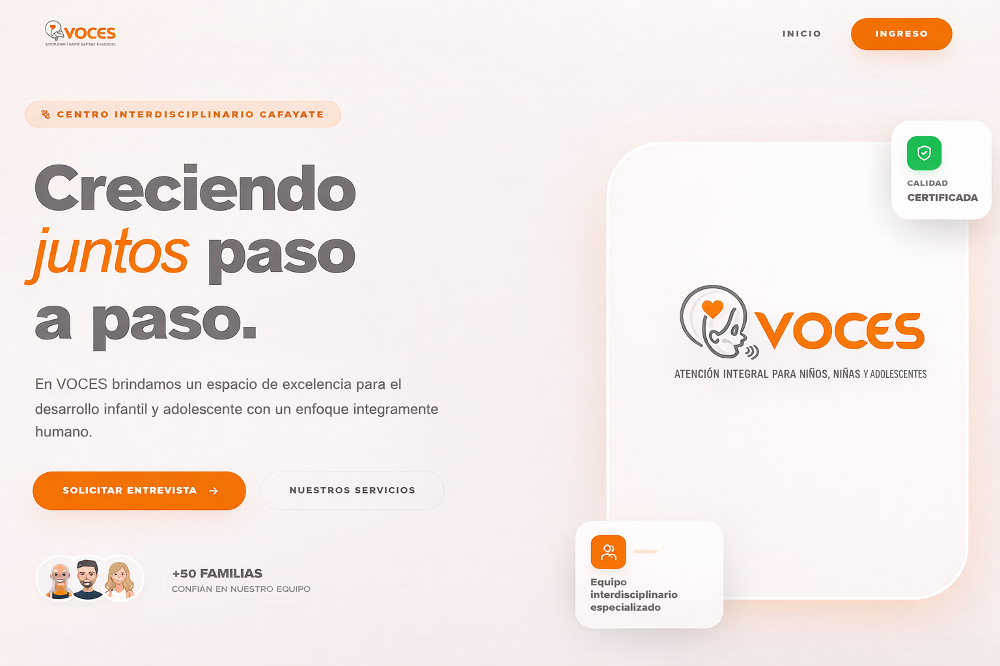
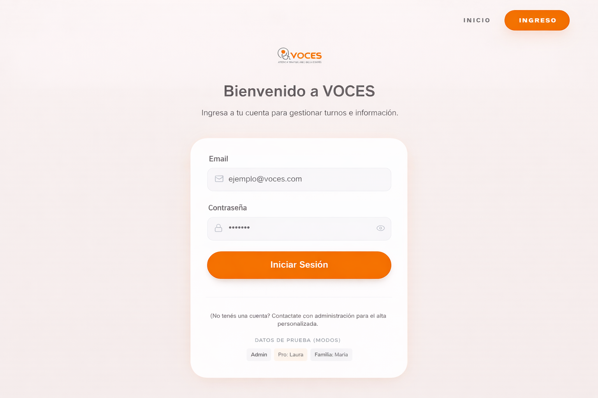
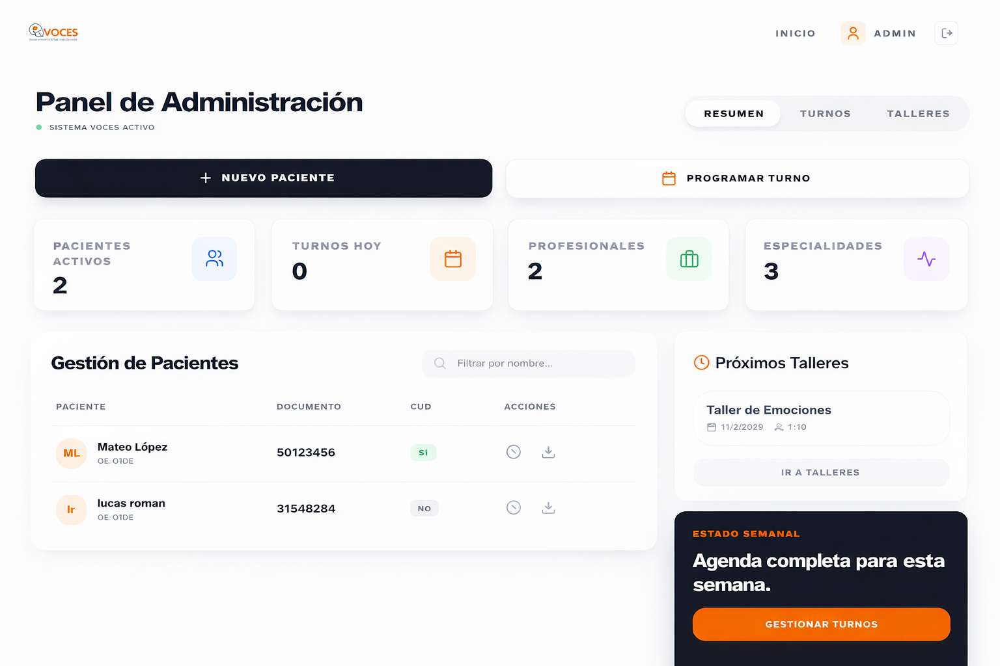
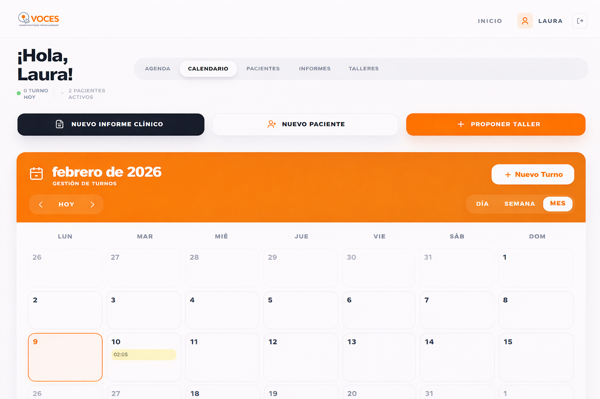
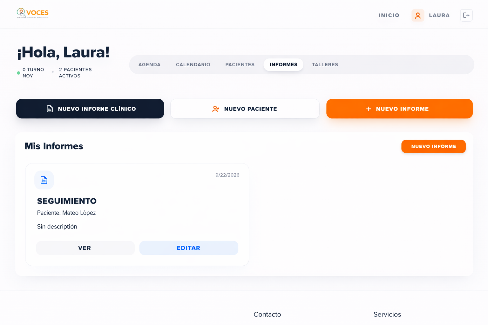
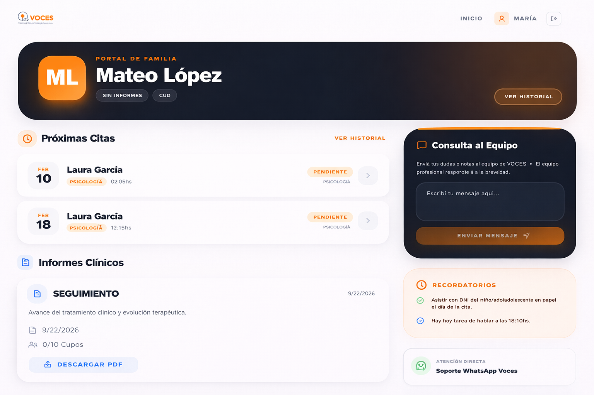

# 🏥 VOCES – Sistema de Atención Integral (Cafayate)


**VOCES** es una plataforma integral de gestión para el centro interdisciplinario de atención en Cafayate. El sistema está diseñado para coordinar el trabajo de profesionales de la salud, la administración central y el seguimiento de las familias de niños, niñas y adolescentes.

---

## 📸 Vista General del Sistema

### Pantalla de Inicio y Acceso
El sistema cuenta con una interfaz moderna y limpia, optimizada para la facilidad de uso.
| Inicio | Panel de Ingreso |
| :---: | :---: |
|  |  |

---

## 🔑 Roles y Funcionalidades Principales

### 1. Panel de Administración (Admin)
Control total sobre la institución, pacientes y logística.
*   **Gestión de Pacientes:** Alta y seguimiento de fichas clínicas completas.
*   **Gestión de Turnos:** Coordinación de agendas de múltiples profesionales.
*   **Talleres:** Creación, aprobación y gestión de documentos para talleres grupales.


*Vista del panel de administración con estadísticas y gestión rápida.*

---

### 2. Panel Profesional
Herramientas especializadas para cada disciplina (Psicología, Fonoaudiología, etc.).
*   **Agenda Inteligente:** Visualización clara de los turnos del día y marcación de asistencia.
*   **Sistema de Informes:** Generación de informes técnicos específicos por especialidad.
*   **Auto-generación Familiar:** Traduce informes técnicos a lenguaje accesible para padres en un solo clic.
*   **Calendario Avanzado:** Vista dinámica por día, semana o mes para gestionar la disponibilidad.

| Calendario Profesional | informes Clínicos |
| :---: | :---: |
|  |  |

---

### 3. Portal de Familias
Acceso directo para los tutores a la información relevante del paciente.
*   **Seguimiento de Turnos:** Visualización de próximas citas y su estado.
*   **Visualización de Informes:** Acceso a los informes generales compartidos por los profesionales.
*   **Turnos para Talleres:** Inscripción directa en actividades institucionales.



---

## 🛠️ Arquitectura Técnica

### Frontend Premium
*   **Core**: React 18 + TypeScript + Vite.
*   **Styling**: Tailwind CSS con un diseño personalizado orientado a la legibilidad y estética profesional.
*   **Animaciones**: Framer Motion para transiciones suaves y feedback visual.
*   **Iconografía**: Lucide React para una semántica visual clara.

### Capa de Datos (`stitch-loop`)
El sistema utiliza una capa de abstracción de datos en `src/hooks/useData.ts` que:
1.  Centraliza todas las operaciones CRUD.
2.  Utiliza `localStorage` para persistencia en demostraciones.
3.  Simula el envío de notificaciones por email.
4.  Permite una migración rápida a una API REST real simplemente cambiando el hook.

---

## 👥 Usuarios de Prueba
Para explorar las diferentes facetas del sistema, utilice las siguientes credenciales en la pantalla de [Login](tmp/login.png):

| Rol | Email | Password |
| :--- | :--- | :--- |
| **Administrador** | `admin@voces.com` | `123` |
| **Profesional** | `laura@voces.com` | `123` |
| **Familia/Tutor** | `maria@gmail.com` | `123` |

---

## 🚀 Instalación y Desarrollo

1.  Clonar el repositorio.
2.  Instalar dependencias:
    ```bash
    npm install
    ```
3.  Iniciar servidor de desarrollo:
    ```bash
    npm run dev
    ```
4.  Generar build de producción:
    ```bash
    npm run build
    ```

---

## 📄 Documentación Adicional
*   [Sistema de Informes Clínicos](SISTEMA_INFORMES.md): Detalle profundo sobre las especialidades y el proceso de interconsulta.
*   [Manual de Sistema de Turnos](tmp/manual-sistema-turnos.pdf): Guía detallada de uso para la gestión de agendas.

---

Desarrollado con ❤️ para el centro **VOCES Cafayate**.
